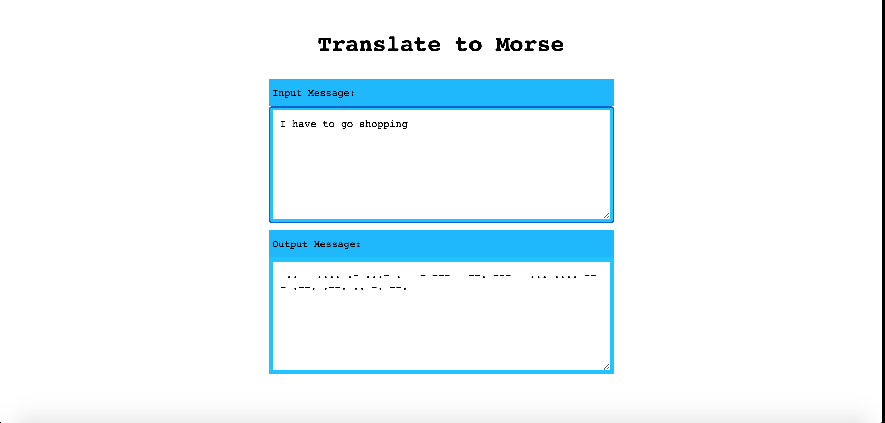

##### MORSE TRANSLATOR

#### Digital Career Institute, Berlin

Assignment

A project to develop a Morse Code Translator.



### Tech used

`JavaScript`
`ES6`
`React`
`CSS`
`HTML5`

### Installation:

```
    npm install
    npm update
```

## Available Scripts

After installing the package, in the project directory, run the below command on terminal:

```
    npm start
```

## Deployment

```
npm install gh-pages --save-dev
npm run build
cd build
npm run deploy

```

Runs the app in the development mode.<br>
Open [http://localhost:3000](http://localhost:3000) to view it in the browser.

The page will reload if you make edits.<br>
You will also see any lint errors in the console.

### `npm test`

Launches the test runner in the interactive watch mode.<br>
See the section about [running tests](https://facebook.github.io/create-react-app/docs/running-tests) for more information.
